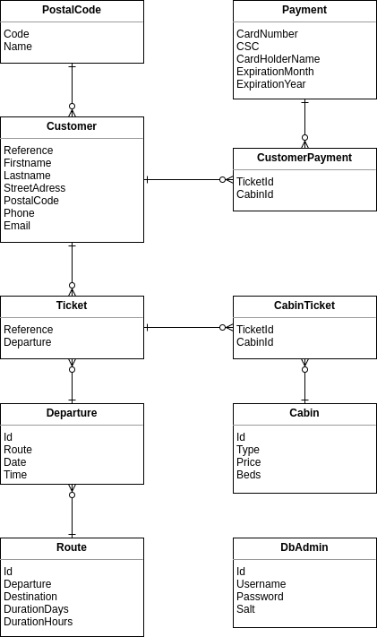

<head>

</head>

# Innlevering 1 Erik, Mats og Ulrik

Gotta git gud, hussle hussle

## Link & References

- [Link to localhost](https://localhost:5001/index.html)

- [Bootstrap Docs](https://getbootstrap.com/docs/4.1/getting-started/introduction/#css)
- [Capitalization conventions](https://docs.microsoft.com/en-us/dotnet/standard/design-guidelines/capitalization-conventions)
- [Hosting options](https://docs.microsoft.com/en-us/aspnet/core/host-and-deploy/?view=aspnetcore-5.0)

- [ColourLine](https://www.colorline.no/)

## ER Model

## TODO

Moved everything to [Trello Kanban Board](https://trello.com/b/Mz4hNbRH/webapp-kanban)

## Q&A @Tor

Q: Why aspnet 3.1?  
A: Just because it was the most recent at the time of making the things.

Q: Design requirements
A: Okay to use bootstrap for styling elements, but the page has to have actual design

Q: Regarding:

> Forsøk å gjøre nettsidene så brukervennlige som mulig. Det gir ingen ekstrapoeng
> å gjøre løsningen så lik som de eksiterende løsninger. Bra design vil også bli
> vektlagt. Dere kan ta bilder fra eksisterende løsninger uten å referere til disse.

A:

Have a few more atributes for the Route:

- Dropdown room type
- Departure
- Arrival

Use bootstrap for actual form formatting and stuff, but side need to look good
form a visual design standpoint.

You are allowed to copy assets from Colourline and other stuff, just make it look
good and make it super useable

Q: Will there be an induvivual task?  
A: Nope, that was only last year

Q: We made a list of tickets fronted but the task does not really expect it, should we make  
A: Woops forgot to ask i dunno

## Feature Creep

#### Frontend Save:

- Responsive amount of customers
- One customer field per customer

- Responsive cabins
- One input field per cabin
- Check if ammont of customers exceeds space in set cabins

#### Frontend List:

- Have QR code based on JSON
- Have list of customer full names on the list.
- Format it sorta like an actual ticked, plain ticket perhaps i dunno

#### Backend:

- Ticket has list of customers
- Ticket object is added onto every customer list that it concerns.
